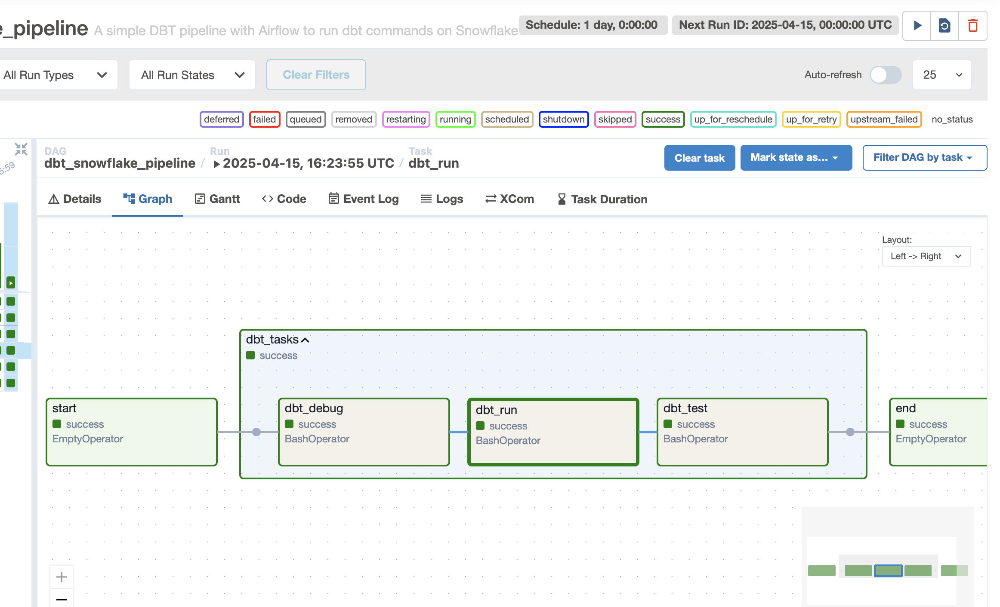
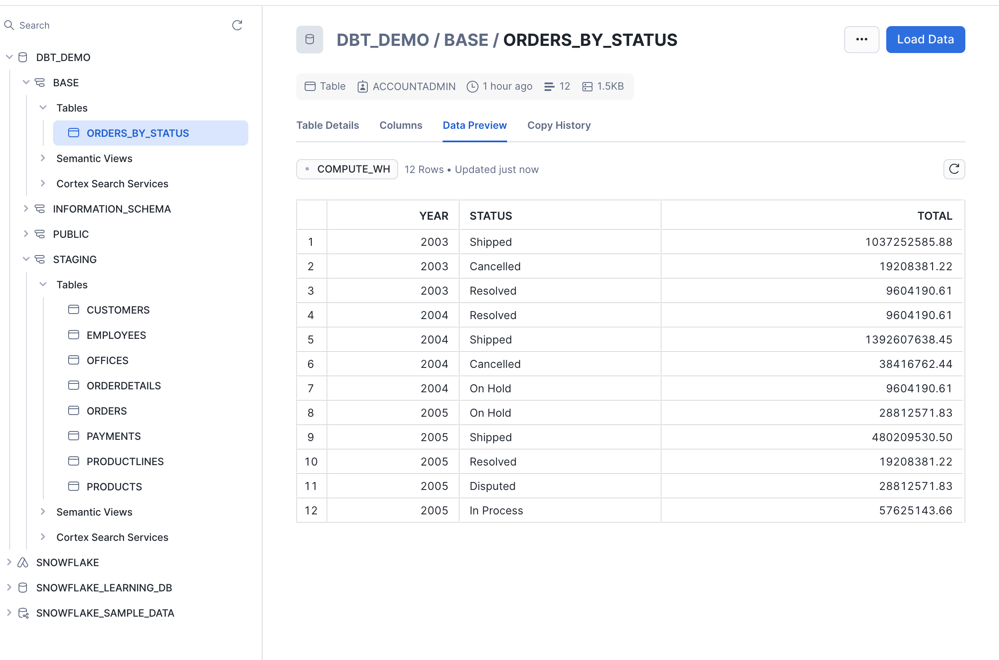

# ELT Pipeline with DBT, Snowflake and Airflow 🚀

## 🎯 Project Goal

The purpose of this project is to built an Extract-Load-Transform pipeline by using **DBT for data transformation** and **Snowflake for data warehousing**, orchestrated by **Airflow**.

## 🧱 Architecture Overview

- **Snowflake**:
  - Database: `DBT_DEMO`
  - Schemas: `STAGING`, `BASE`, `PUBLIC`
  - Source table: `ORDERS` (in STAGING)

- **DBT**:
  - Source: `orders`
  - Model: `orders_by_status` (stored in BASE)
  - Logic: Aggregation by year and order status

- **Airflow**:
  - DAG runs: `dbt debug`, `dbt run`, `dbt test`
  - DAG: `elt_dbt_pipeline`

## 🛠️ Setup Instructions

### 1. Clone the repo & create virtualenv

```bash
python -m venv airflow-env
source airflow-env/bin/activate
pip install -r requirements.txt
```

### 2. Snowflake Initialization

Use `dbt_demo_snowflake_init.sql` in Snowflake UI to:

- Create `DBT_DEMO` database
- Create `STAGING`, `BASE`, `PUBLIC` schemas
- Copy the content of `dbt_demo_snowflake_init.sql` in SQL script and `run all` to load all tables into `STAGING`

### 3. DBT setup

```bash
cd dbt_project (here snowflake where I want to create the dbt project)
dbt init (choose the corresponding number for SNOWFLAKE & enter all the corresponding informations like username, password, role, database, ...)
dbt debug (to test if all pass & is ok)
dbt run (to run the model)
```

### 4. Airflow setup
For this first version, I decide to use Airflow in local without docker by:
- Step 1 : Create python env
- Step 2: install apache-airflow => pip install apache-airflow
- Step 3: initialize db & create the database schema => airflow db init => airflow db migrate
- Step 4: create admin user => airflow users create --username admin --password admin --firstname airflow --lastname airflow --role Admin --email admin@example.org
- Step 5: start webserver & scheduler => airflow webserver -p 9090 & airflow scheduler
- Step 6: Login & run the dags
Don't forget thus command `export AIRFLOW_HOME=$(pwd)` otherwise the Airflow`s folder(dags, logs, cfg...) will be created to the root(~ => here /Users/user/airflow )

```bash
source airflow-env/bin/activate
airflow db init
airflow users create ...
airflow webserver &
airflow scheduler &
```

Make sure to set in your DAG:
```python
env={"DBT_PROFILES_DIR": "/Users/<your-username>/.dbt"}
```

### 5. Trigger the DAG

Go to Airflow UI → run `dbt_snowflake_pipeline`

## 📂 Project Structure

```
.
├── dags/
│   └── dbt_snowflake_airflow.py
├── snowflake/
│   ├── models/
│   ├── dbt_project.yml
├── dbt_demo_snowflake_init.sql
├── requirements.txt
└── README.md
```

## ✅ Output

Table created: `DBT_DEMO.BASE.orders_by_status`  
Aggregated by year & status.

---

## 📌 Notes

- Snowflake Warehouse: `COMPUTE_WH`
- Role: `ACCOUNTADMIN`
- DBT profile: defined in `~/.dbt/profiles.yml`

## 📧 Snapshots



